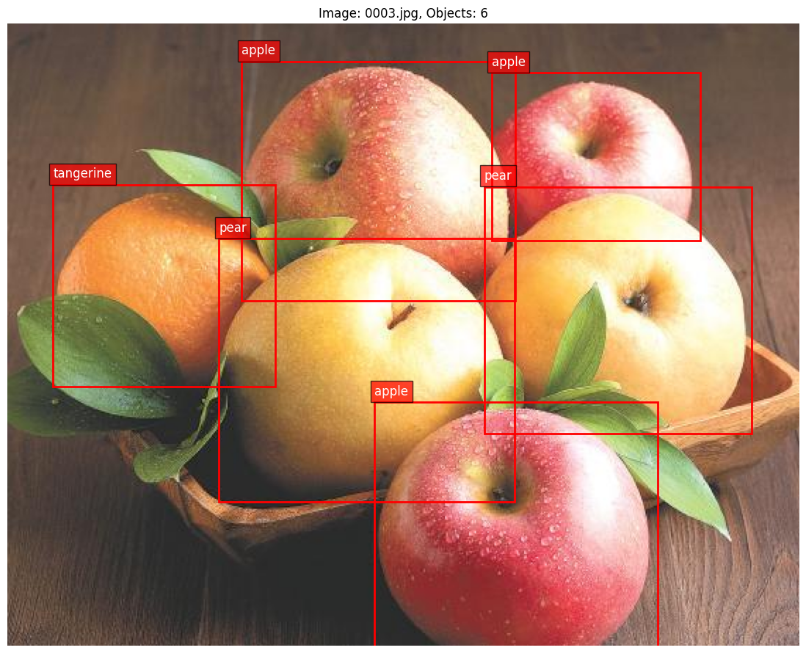
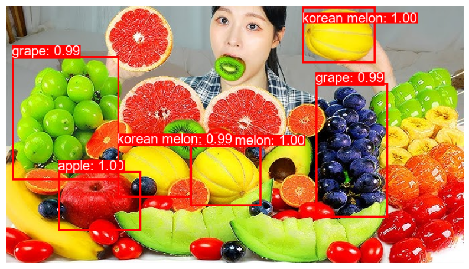

<p align="center">
  <a href="https://www.uit.edu.vn/" title="Trường Đại học Công nghệ Thông tin" style="border: 5;">
    
  </a>
</p>

<h1 align="center"><b>CS231.P22 - NHẬP MÔN THỊ GIÁC MÁY TÍNH</b></h1>

<p align="center">
    <a href="https://pytorch.org/"></a>
    <a href="https://www.python.org/"></a>
    <a href="./LICENSE"></a>
</p>

## MỤC LỤC
* [Giới thiệu môn học](#gioi-thieu-mon-hoc)
* [Giảng viên hướng dẫn](#giang-vien-huong-dan)
* [Sinh viên thực hiện](#sinh-vien-thuc-hien)
* [Đồ án](#do-an)
* [Kiến trúc mô hình](#kien-truc-mo-hinh)
* [Dữ liệu](#du-lieu)
* [Chiến lược huấn luyện](#chien-luoc-huan-luyen)
* [Kết quả thực nghiệm](#ket-qua-thuc-nghiem)
* [Demo](#demo)
* [Kaggle Notebook](#kaggle-notebook)
* [Tham khảo](#tham-khao)

## GIỚI THIỆU MÔN HỌC
<a name="gioi-thieu-mon-hoc"></a>
* **Tên môn học**: Nhập môn Thị giác máy tính
* **Mã môn học**: CS231
* **Mã lớp**: CS231.P22
* **Năm học**: Học kỳ 2, 2024 - 2025

## GIẢNG VIÊN HƯỚNG DẪN
<a name="giang-vien-huong-dan"></a>
* **TS. Mai Tiến Dũng** - *dungmt@uit.edu.vn*

## SINH VIÊN THỰC HIỆN
<a name="sinh-vien-thuc-hien"></a>
| MSSV | Họ và tên | Github | Email |
|:----------:|:-------------------:|:----------------------------------------------------:|:-----------------------:|
| 22521587 | Trương Phúc Trường | [Truong99zvc](https://github.com/Truong99zvc/) | 22521587@gm.uit.edu.vn |

## ĐỒ ÁN
<a name="do-an"></a>
**Tên đồ án**: NHẬN DIỆN VÀ PHÂN LOẠI MỘT SỐ LOẠI TRÁI CÂY

Đồ án tập trung nghiên cứu và triển khai mô hình **Faster R-CNN**. Quá trình thực hiện bao gồm:
* Tiền xử lý dữ liệu và chuyển đổi định dạng nhãn.
* Xây dựng và tùy chỉnh kiến trúc mô hình với các chiến lược Transfer Learning khác nhau.
* Đánh giá hiệu suất mô hình qua các độ đo mAP, AR và mIoU.

## KIẾN TRÚC MÔ HÌNH
<a name="kien-truc-mo-hinh"></a>
Sử dụng kiến trúc **Faster R-CNN** với backbone **ResNet50-FPN**. Đây là kiến trúc Object Detection hai giai đoạn (two-stage detector) mạnh mẽ.

<p align="center">
  <a href="https://medium.com/@RobuRishabh/understanding-and-implementing-faster-r-cnn-248f7b25ff96">
    
  </a>
  <br><i>Hình 1: Kiến trúc tổng quan của mô hình Faster R-CNN</i>
</p>

## DỮ LIỆU
<a name="du-lieu"></a>
### Nguồn dữ liệu
Sử dụng bộ dữ liệu **Fruit Object Detection** từ [Kaggle/Dataset Ninja](https://datasetninja.com/fruit-object-detection). Bao gồm 11 loại trái cây: táo, quýt, lê, dưa hấu, sầu riêng, chanh, nho, dứa, thanh long, dưa lê Hàn Quốc và dưa lưới.

### Cấu trúc thư mục (COCO Format)
Dữ liệu gốc được chuyển đổi từ định dạng YOLO sang định dạng COCO để tương thích với thư viện `torchvision`.

```text
dataset/
├── train/
│   ├── images/                # 3076 ảnh huấn luyện
│   └── train_annotations.json # Nhãn định dạng COCO
├── validation/
│   ├── images/                # 769 ảnh kiểm tra (20% train)
│   └── validation_annotations.json
└── test/
    ├── images/                # 640 ảnh đánh giá độc lập
    └── test_annotations.json
```

## CHIẾN LƯỢC HUẤN LUYỆN
<a name="chien-luoc-huan-luyen"></a>
Ba chiến lược huấn luyện được thực nghiệm để đánh giá tầm quan trọng của Học chuyển giao (Transfer Learning):

1. **Train from Scratch**: Khởi tạo trọng số ngẫu nhiên, không sử dụng kiến thức tiền huấn luyện (`weights=None`, `weights_backbone=None`).
2. **Pre-trained Backbone**: Chỉ sử dụng backbone ResNet50 đã huấn luyện trên ImageNet (`weights_backbone=DEFAULT`), các lớp khác khởi tạo ngẫu nhiên.
3. **Fine-tune Full Model**: Load toàn bộ trọng số Faster R-CNN đã huấn luyện trên COCO (`weights='DEFAULT'`) và tinh chỉnh lớp phân loại cuối.

**Thông số cấu hình chung:**
* **Python**: 3.13 (Kaggle Environment).
* **Optimizer**: Adam (`lr=1e-4`, `weight_decay=5e-4`).
* **Scheduler**: StepLR (`step_size=7`, `gamma=0.1`).

## KẾT QUẢ THỰC NGHIỆM
<a name="ket-qua-thuc-nghiem"></a>

| Chiến lược | Kết quả (mAP@[.5:.95]) | Kaggle Version | Biểu đồ kết quả |
|:---|:---:|:---:|:---:|
| Train từ đầu | 0.0478 | V1 | images/v1.png |
| Backbone Pre-trained | 0.6851 | V5 | images/v5.png |
| Fine-tune Toàn bộ | 0.7034 | V2 | images/v2.png |

<p align="center">
  
  
  
  <br><i>Hình 2: So sánh biểu đồ Loss và mAP của 3 chiến lược thực nghiệm (V1, V5, V2)</i>
</p>

## DEMO
<a name="demo"></a>
Khả năng nhận diện của mô hình tốt nhất (Fine-tune Full Model) trên các mẫu ảnh thực tế phức tạp.

<p align="center">
  
  <br><br>
  
  <br><i>Hình 3: Kết quả dự đoán trên ảnh đơn và ảnh thực tế phức tạp (Mukbang)</i>
</p>

## KAGGLE NOTEBOOK
<a name="kaggle-notebook"></a>
Mã nguồn chi tiết và quá trình huấn luyện có thể truy cập tại:
> [CS231 - Faster R-CNN from Pytorch](https://www.kaggle.com/code/gtekx9/cs231-faster-rcnn-from-pytorch)

## THAM KHẢO
<a name="tham-khao"></a>
* [1] Shaoqing Ren et al., "Faster R-CNN: Towards Real-Time Object Detection with Region Proposal Networks," 2015.
* [2] Thư viện PyTorch `torchvision.models.detection`.