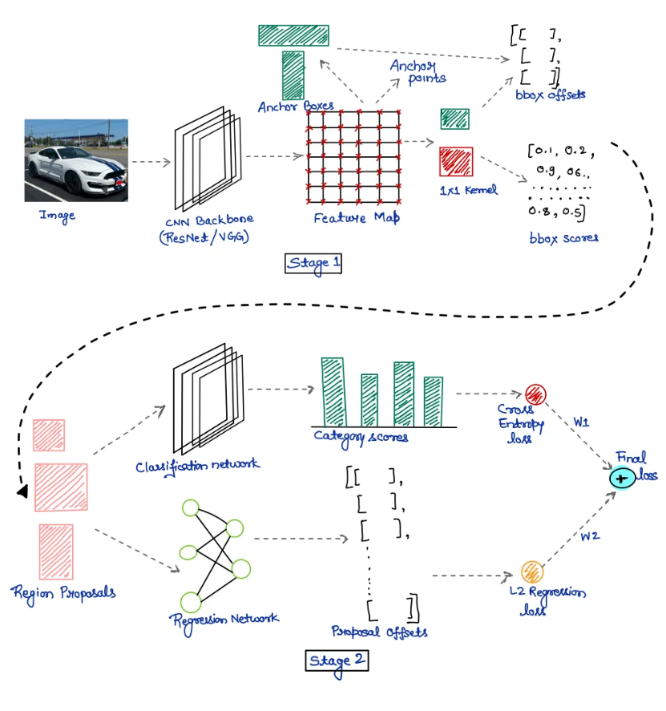
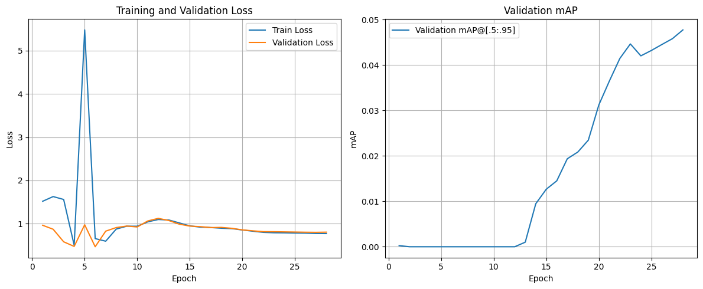
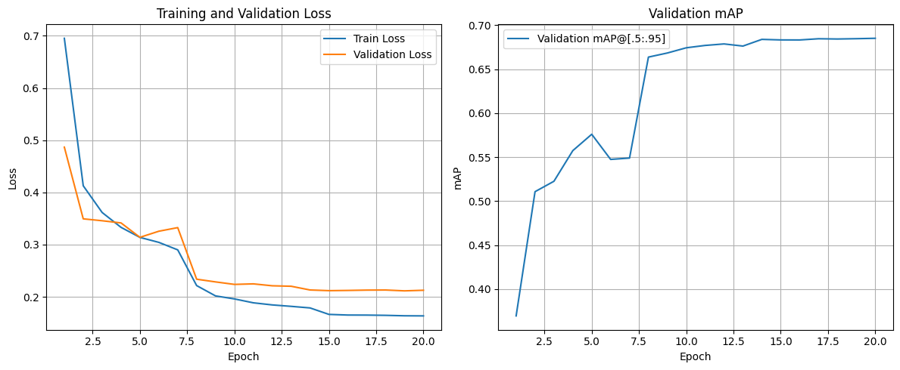
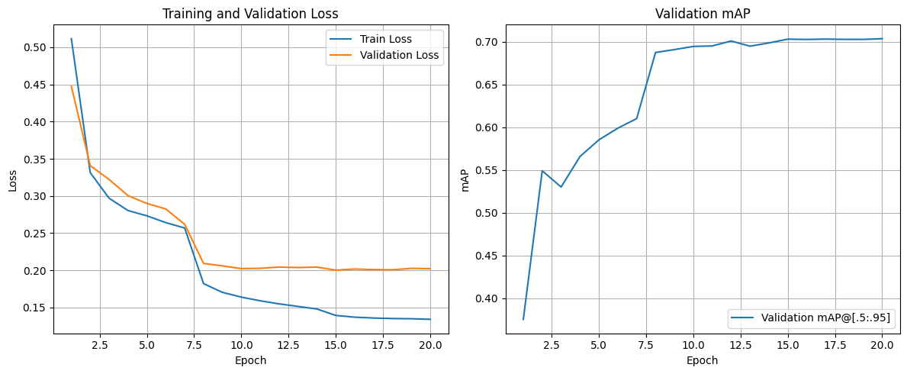

<p align="center">
  <a href="https://www.uit.edu.vn/" title="University of Information Technology">
    
  </a>
</p>

<h1 align="center"><b>CS231.P22 - Introduction to Computer Vision</b></h1>

<p align="center">
    <a href="https://pytorch.org/"></a>
    <a href="https://www.python.org/"></a>
    <a href="./LICENSE"></a>
</p>

## Table of Contents
- [Course overview](#course-overview)
- [Instructor](#instructor)
- [Student](#student)
- [Project](#project)
- [Model architecture](#model-architecture)
- [Dataset](#dataset)
- [Training strategies](#training-strategies)
- [Experimental results](#experimental-results)
- [Demo](#demo)
- [Kaggle notebook](#kaggle-notebook)
- [References](#references)

## Course overview
<a name="course-overview"></a>
- **Course name**: Introduction to Computer Vision
- **Course code**: CS231
- **Class code**: CS231.P22
- **Academic year**: Semester 2, 2024 - 2025

## Instructor
<a name="instructor"></a>
- **Dr. Mai Tien Dung** - dungmt@uit.edu.vn

## Student
<a name="student"></a>
| ID | Name | GitHub | Email |
|:---:|:-------------------:|:----------------------------------------------------:|:-----------------------:|
| 22521587 | Truong Phuc Truong | [Truong99zvc](https://github.com/Truong99zvc/) | 22521587@gm.uit.edu.vn |

## Project
<a name="project"></a>
Title: Fruit Detection and Classification — Implementing Faster R-CNN

This project implements and evaluates a Faster R-CNN detector for 11 fruit categories. Main tasks include:
- Data preprocessing and label conversion (YOLO -> COCO)
- Model building and experimentation with transfer learning strategies
- Evaluation using mAP, AR and mean IoU metrics

## Model architecture
<a name="model-architecture"></a>
We use Faster R-CNN with a ResNet-50 FPN backbone (two-stage detector).

<p align="center">
  <a href="https://medium.com/@RobuRishabh/understanding-and-implementing-faster-r-cnn-248f7b25ff96">
    
  </a>
  <br><i>Figure 1: Faster R-CNN overview</i>
</p>

## Dataset
<a name="dataset"></a>
Dataset: Fruit Object Detection (from Kaggle / Dataset Ninja). The dataset contains 11 classes: apple, tangerine, pear, watermelon, durian, lemon, grape, pineapple, dragon fruit, korean melon, cantaloupe.

Directory structure (COCO format):

```text
dataset/
├── train/
│   ├── images/
│   └── train_annotations.json
├── validation/
│   ├── images/
│   └── validation_annotations.json
└── test/
    ├── images/
    └── test_annotations.json
```

The dataset used in this project was converted from YOLO format to COCO format for compatibility with `torchvision` utilities.

## Training strategies
<a name="training-strategies"></a>
We experimented with three training strategies to measure transfer learning effects:

1. Train from Scratch: random initialization (no pretrained weights).
2. Pretrained Backbone: use ImageNet-pretrained backbone, randomly initialize other parts.
3. Fine-tune Full Model: initialize with pretrained Faster R-CNN weights and fine-tune the whole network.

Common configuration:
- Python 3.13
- Optimizer: Adam (lr=1e-4, weight_decay=5e-4)
- Scheduler: StepLR (step_size=7, gamma=0.1)

## Experimental results
<a name="experimental-results"></a>

| Strategy | mAP@[.5:.95] | Notes | Result image |
|:---|:---:|:---|:---|
| Train from Scratch | 0.0478 | V1 | images/v1.png |
| Backbone Pretrained | 0.6851 | V5 | images/v5.png |
| Fine-tune Full Model | 0.7034 | V2 | images/v2.png |

<p align="center">
  
  
  
  <br><i>Figure 2: Loss and mAP comparison for three strategies (V1, V5, V2)</i>
</p>

## Demo
<a name="demo"></a>
This repository now contains a Streamlit demo app that lets you load any of the three trained models and run inference on uploaded images.

- Demo folder: [demo_streamlit](demo_streamlit)
- Demo entrypoint: [demo_streamlit/app.py](demo_streamlit/app.py)
- Demo dependencies: [demo_streamlit/requirements.txt](demo_streamlit/requirements.txt)

Provided model links (Google Drive). You can either let the Streamlit app attempt to download them automatically (requires `gdown`), or download and place them under `demo_streamlit/models` with the filenames shown below.

Model files and suggested filenames:

- Train from Scratch — suggested filename: `model_scratch.pth`
  - https://drive.google.com/file/d/1sEtlFPUAjM2UgbUL3imPw6tdHGrgq9AW/view?usp=sharing
- Backbone Pretrained — suggested filename: `model_backbone_pretrained.pth`
  - https://drive.google.com/file/d/1_EX4m02uwZn7SQhNMLPUFqsOxStV1ZZI/view?usp=sharing
- Fine-tune Full Model — suggested filename: `model_finetune_full.pth`
  - https://drive.google.com/file/d/1K2g9D4mpMKO_RICzXzTWCRAPbSNxi-rg/view?usp=sharing

Note: After I add these example filenames to the README, you said you'll rename your uploaded Drive files accordingly — that will make the demo's auto-download and the app easier to use.

How to run the demo locally (example):

```bash
# create a venv, install dependencies
python -m venv .venv
source .venv/bin/activate  # or .venv\Scripts\activate on Windows
pip install -r demo_streamlit/requirements.txt

# run the streamlit app
streamlit run demo_streamlit/app.py
```

If automatic download with `gdown` fails, download each model manually from the Drive links above and place them in `demo_streamlit/models` with the exact suggested filenames.

## Kaggle notebook
<a name="kaggle-notebook"></a>
Full training and experiment code is available at:
> [CS231 - Faster R-CNN from Pytorch](https://www.kaggle.com/code/gtekx9/cs231-faster-rcnn-from-pytorch)

## References
<a name="references"></a>
* Shaoqing Ren et al., "Faster R-CNN: Towards Real-Time Object Detection with Region Proposal Networks," 2015.
* PyTorch `torchvision.models.detection` documentation.